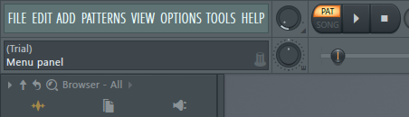
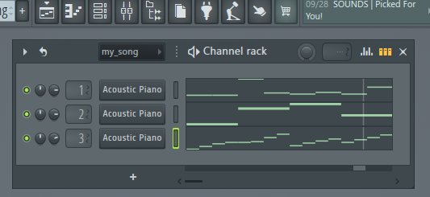

Program Usage
===============================

Theme
-----------------------------

Choosing a theme for the song
~~~~~~~~~~~~~~~~~~~~~~~~~~~~~

To run the program, make sure to navigate into the directory that main.py is in, and then type: ‘python main.py’ this will then prompt you with some questions. The first is asking if you want the song in major or minor. A moodier song would most likely be made with the minor key, and a more upbeat happy song would be made in the major key. The next question will then ask you to pick from: “slow”, “medium”, “fast”, or a custom number. This influences how quickly notes will be played, in other words, the tempo of the song.

Runtime
-----------------------------

What to do during runtime
~~~~~~~~~~~~~~~~~~~~~~~~~~~~~

During runtime, the AI will produce songs and spit out a single song that you can then input in either “yes” you do like it, or “no” you don’t like it. From that decision, the AI will regenerate songs and the process will continue until you hear a song that you are satisfied with.

Getting it into FL Studio
-----------------------------

Exporting and importing into FL Studio
~~~~~~~~~~~~~~~~~~~~~~~~~~~~~

Once you are satisfied with the song produced, you can find it in the same place as the program as a .midi file. To import the song generated into FL studio, first open FL studio, then at the top left, select: File->import->MidiFile->find where the midi file was saved to. If you have no windows currently open in FL studio, then it may look like nothing has happened.

Editing in FL Studio
-----------------------------

How to tweak in FL Studio
~~~~~~~~~~~~~~~~~~~~~~~~~~~~~

To run the song you have in the FL studio, click the play button at the top near the left side of the screen. To start tweaking the song, start by opening the channel rack tool (labelled: View channel rack, when you mouse over it). This should then open up a window where you can see three different tracks currently being played. From here you can start by changing out instruments in the channel rack by clicking on buttons that by default are labelled acoustic piano. This should then give you many options to play around with. Volume can be found per specific track right next to the button used to change instruments, and if you want to change the overall volume in FL studio, use the volume tool to the left of the play button. These are just some tools to get you started. If you don’t have much sound design experience, focus on creating a good song with the AI so you won’t have to spend a lot of time in FL studio. 

Getting it out of FL studio
-----------------------------

Exporting from FL Studio
~~~~~~~~~~~~~~~~~~~~~~~~~~~~~

Similarly to how you imported, go to: File->export->mp3, give it a name and choose where you want to save it to (can even save directly to a specific project). From here, you can add it to the project (if you didn’t do it directly), or start using the song in your game!
